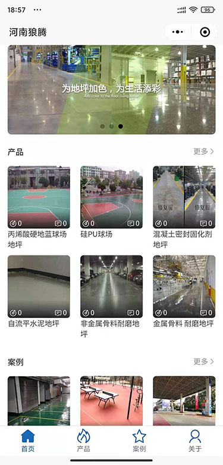
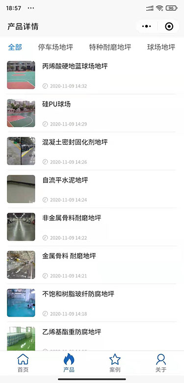
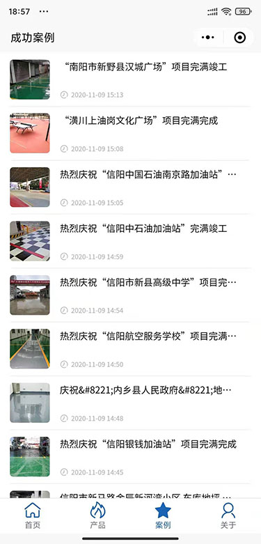
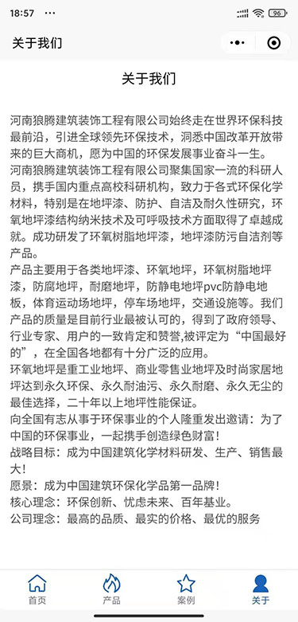
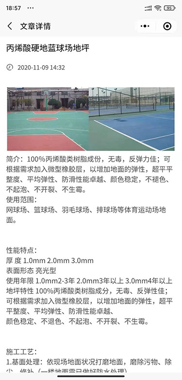

### Cude 小程序源码

这个星球上40%的网站都在使用WordPress，小到兴趣博客，大到新闻网站。WordPress已经不仅仅是一个博客网站程序，而是一个强大的CMS系统。开源、完善的社区、丰富的接口等等优势正将wordpress推向更高更广泛的领域。

WP REST API 是wordpress的一个插件，为wordpress提供对外标准的RESTFul接口，随着RESTFul的畅行和各种前端框架的出现，WP REST API可以让wordpress不仅仅存在WEB端，可以让wordpress不仅仅履行一个博客功能，而是可以让wordpress程序作为后台终端（BackEnd），然后以各种应用的形式实现在各种各样的设备中。

Cude 就是使用Uni-app开发前端，使用 Wordpress RESTful API 作为后端接口。最大的优势就是 Wordpress发布的内容可以直接显示在使用Cude做的小程序上。

### 项目截图
;
;
;
;
;

### 贡献者
 - Author: ngtwewy <62006464@qq.com>
 - Author URI: http://javascript.net.cn
 - Project URI: https://github.com/ngtwewy/basicform
 - License: Apache Licence 2.0
 - License URI: http://www.apache.org/licenses/LICENSE-2.0

### 授权
- 小程序只提供试用，如需商用请购买授权，价格：300元
- 小程序全开源，无任何隐藏代码，零广告，零风险
- 一次购买，永久免费更新
- 一次购买，终身售后技术支持

